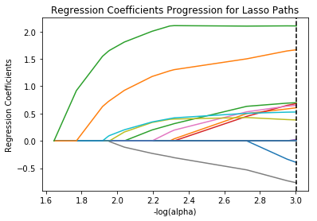
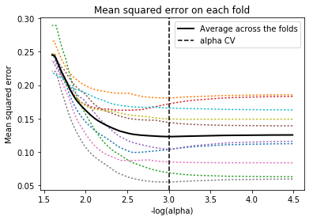

# Machine-Learning-for-Data-Analysis-Assignment-3

Assignment 3- Machine Learning for Data Analysis
======

Description of Dataset
----

## Source ##
For this assignment the Statlog (Heart) Data Set ([Link](https://archive.ics.uci.edu/ml/datasets/Statlog+%28Heart%29)) obtained from [UCI Machine Learning Repository](https://archive.ics.uci.edu/ml/datasets.html) is used. 


## Description
### Attribute Information:
 1. age
 2. sex
 3. chest pain type  (4 values)
 4. resting blood pressure
 5. serum cholestoral in mg/dl
 6. fasting blood sugar > 120 mg/dl
 7. resting electrocardiographic results  (values 0,1,2)
 8. maximum heart rate achieved
 9. exercise induced angina
 10. oldpeak = ST depression induced by exercise relative to rest
 11. the slope of the peak exercise ST segment
 12. number of major vessels (0-3) colored by flourosopy
 13. thal: 3 = normal; 6 = fixed defect; 7 = reversable defect
 
### Variable to be predicted
Absence (1) or presence (2) of heart disease

# Code


```python
#Importing Pandas
from pandas import Series, DataFrame
import pandas as pd

#Importing NumPy
import numpy as np

# Matplotlib to plot
import matplotlib.pylab as plt

#Importing sklearn 
from sklearn.cross_validation import train_test_split
from sklearn.linear_model import LassoLarsCV
from sklearn.metrics import classification_report
import sklearn.metrics

%matplotlib inline
```

Reading the dataset as raw_data as assigning names of attributes to each coloumn. Also visualising at top five rows of the data. 


```python
raw_data = pd.read_csv("heart.dat", delimiter=' ', names = ["age", "sex", "chestPainType", "RestBP", "SerumCholesterol", "FastingBP", "RestingECG", "MaxHR", "ExerciseInduceAgina", "Oldepeak", "SlopSTSegment", "NoVessels", "Thal", "Result"])

raw_data.head()
```


<div>
<table border="1" class="dataframe">
  <thead>
    <tr style="text-align: right;">
      <th></th>
      <th>age</th>
      <th>sex</th>
      <th>chestPainType</th>
      <th>RestBP</th>
      <th>SerumCholesterol</th>
      <th>FastingBP</th>
      <th>RestingECG</th>
      <th>MaxHR</th>
      <th>ExerciseInduceAgina</th>
      <th>Oldepeak</th>
      <th>SlopSTSegment</th>
      <th>NoVessels</th>
      <th>Thal</th>
      <th>Result</th>
    </tr>
  </thead>
  <tbody>
    <tr>
      <th>0</th>
      <td>70.0</td>
      <td>1.0</td>
      <td>4.0</td>
      <td>130.0</td>
      <td>322.0</td>
      <td>0.0</td>
      <td>2.0</td>
      <td>109.0</td>
      <td>0.0</td>
      <td>2.4</td>
      <td>2.0</td>
      <td>3.0</td>
      <td>3.0</td>
      <td>2</td>
    </tr>
    <tr>
      <th>1</th>
      <td>67.0</td>
      <td>0.0</td>
      <td>3.0</td>
      <td>115.0</td>
      <td>564.0</td>
      <td>0.0</td>
      <td>2.0</td>
      <td>160.0</td>
      <td>0.0</td>
      <td>1.6</td>
      <td>2.0</td>
      <td>0.0</td>
      <td>7.0</td>
      <td>1</td>
    </tr>
    <tr>
      <th>2</th>
      <td>57.0</td>
      <td>1.0</td>
      <td>2.0</td>
      <td>124.0</td>
      <td>261.0</td>
      <td>0.0</td>
      <td>0.0</td>
      <td>141.0</td>
      <td>0.0</td>
      <td>0.3</td>
      <td>1.0</td>
      <td>0.0</td>
      <td>7.0</td>
      <td>2</td>
    </tr>
    <tr>
      <th>3</th>
      <td>64.0</td>
      <td>1.0</td>
      <td>4.0</td>
      <td>128.0</td>
      <td>263.0</td>
      <td>0.0</td>
      <td>0.0</td>
      <td>105.0</td>
      <td>1.0</td>
      <td>0.2</td>
      <td>2.0</td>
      <td>1.0</td>
      <td>7.0</td>
      <td>1</td>
    </tr>
    <tr>
      <th>4</th>
      <td>74.0</td>
      <td>0.0</td>
      <td>2.0</td>
      <td>120.0</td>
      <td>269.0</td>
      <td>0.0</td>
      <td>2.0</td>
      <td>121.0</td>
      <td>1.0</td>
      <td>0.2</td>
      <td>1.0</td>
      <td>1.0</td>
      <td>3.0</td>
      <td>1</td>
    </tr>
  </tbody>
</table>
</div>


```python
raw_data.describe().transpose()
```


<div>
<table border="1" class="dataframe">
  <thead>
    <tr style="text-align: right;">
      <th></th>
      <th>count</th>
      <th>mean</th>
      <th>std</th>
      <th>min</th>
      <th>25%</th>
      <th>50%</th>
      <th>75%</th>
      <th>max</th>
    </tr>
  </thead>
  <tbody>
    <tr>
      <th>age</th>
      <td>270.0</td>
      <td>54.433333</td>
      <td>9.109067</td>
      <td>29.0</td>
      <td>48.0</td>
      <td>55.0</td>
      <td>61.0</td>
      <td>77.0</td>
    </tr>
    <tr>
      <th>sex</th>
      <td>270.0</td>
      <td>0.677778</td>
      <td>0.468195</td>
      <td>0.0</td>
      <td>0.0</td>
      <td>1.0</td>
      <td>1.0</td>
      <td>1.0</td>
    </tr>
    <tr>
      <th>chestPainType</th>
      <td>270.0</td>
      <td>3.174074</td>
      <td>0.950090</td>
      <td>1.0</td>
      <td>3.0</td>
      <td>3.0</td>
      <td>4.0</td>
      <td>4.0</td>
    </tr>
    <tr>
      <th>RestBP</th>
      <td>270.0</td>
      <td>131.344444</td>
      <td>17.861608</td>
      <td>94.0</td>
      <td>120.0</td>
      <td>130.0</td>
      <td>140.0</td>
      <td>200.0</td>
    </tr>
    <tr>
      <th>SerumCholesterol</th>
      <td>270.0</td>
      <td>249.659259</td>
      <td>51.686237</td>
      <td>126.0</td>
      <td>213.0</td>
      <td>245.0</td>
      <td>280.0</td>
      <td>564.0</td>
    </tr>
    <tr>
      <th>FastingBP</th>
      <td>270.0</td>
      <td>0.148148</td>
      <td>0.355906</td>
      <td>0.0</td>
      <td>0.0</td>
      <td>0.0</td>
      <td>0.0</td>
      <td>1.0</td>
    </tr>
    <tr>
      <th>RestingECG</th>
      <td>270.0</td>
      <td>1.022222</td>
      <td>0.997891</td>
      <td>0.0</td>
      <td>0.0</td>
      <td>2.0</td>
      <td>2.0</td>
      <td>2.0</td>
    </tr>
    <tr>
      <th>MaxHR</th>
      <td>270.0</td>
      <td>149.677778</td>
      <td>23.165717</td>
      <td>71.0</td>
      <td>133.0</td>
      <td>153.5</td>
      <td>166.0</td>
      <td>202.0</td>
    </tr>
    <tr>
      <th>ExerciseInduceAgina</th>
      <td>270.0</td>
      <td>0.329630</td>
      <td>0.470952</td>
      <td>0.0</td>
      <td>0.0</td>
      <td>0.0</td>
      <td>1.0</td>
      <td>1.0</td>
    </tr>
    <tr>
      <th>Oldepeak</th>
      <td>270.0</td>
      <td>1.050000</td>
      <td>1.145210</td>
      <td>0.0</td>
      <td>0.0</td>
      <td>0.8</td>
      <td>1.6</td>
      <td>6.2</td>
    </tr>
    <tr>
      <th>SlopSTSegment</th>
      <td>270.0</td>
      <td>1.585185</td>
      <td>0.614390</td>
      <td>1.0</td>
      <td>1.0</td>
      <td>2.0</td>
      <td>2.0</td>
      <td>3.0</td>
    </tr>
    <tr>
      <th>NoVessels</th>
      <td>270.0</td>
      <td>0.670370</td>
      <td>0.943896</td>
      <td>0.0</td>
      <td>0.0</td>
      <td>0.0</td>
      <td>1.0</td>
      <td>3.0</td>
    </tr>
    <tr>
      <th>Thal</th>
      <td>270.0</td>
      <td>4.696296</td>
      <td>1.940659</td>
      <td>3.0</td>
      <td>3.0</td>
      <td>3.0</td>
      <td>7.0</td>
      <td>7.0</td>
    </tr>
    <tr>
      <th>Result</th>
      <td>270.0</td>
      <td>1.444444</td>
      <td>0.497827</td>
      <td>1.0</td>
      <td>1.0</td>
      <td>1.0</td>
      <td>2.0</td>
      <td>2.0</td>
    </tr>
  </tbody>
</table>
</div>


Creating dataframe without the target (col name = results)


```python
predictors = raw_data.drop(["Result"], axis=1)
#Shape of the data.
predictors.shape
```


    (270, 13)


Storing target values in new array


```python
targets = raw_data.Result
```


```python
from sklearn import preprocessing
```


```python
predictors.shape
ListOfFeatures = list(predictors)
predictors_new = pd.DataFrame(preprocessing.scale(predictors, with_mean=True, with_std=True))
predictors_new.columns = ListOfFeatures
predictors_new.head()
```


<div>
<table border="1" class="dataframe">
  <thead>
    <tr style="text-align: right;">
      <th></th>
      <th>age</th>
      <th>sex</th>
      <th>chestPainType</th>
      <th>RestBP</th>
      <th>SerumCholesterol</th>
      <th>FastingBP</th>
      <th>RestingECG</th>
      <th>MaxHR</th>
      <th>ExerciseInduceAgina</th>
      <th>Oldepeak</th>
      <th>SlopSTSegment</th>
      <th>NoVessels</th>
      <th>Thal</th>
    </tr>
  </thead>
  <tbody>
    <tr>
      <th>0</th>
      <td>1.712094</td>
      <td>0.689500</td>
      <td>0.870928</td>
      <td>-0.075410</td>
      <td>1.402212</td>
      <td>-0.417029</td>
      <td>0.981664</td>
      <td>-1.759208</td>
      <td>-0.701222</td>
      <td>1.181012</td>
      <td>0.676419</td>
      <td>2.472682</td>
      <td>-0.875706</td>
    </tr>
    <tr>
      <th>1</th>
      <td>1.382140</td>
      <td>-1.450327</td>
      <td>-0.183559</td>
      <td>-0.916759</td>
      <td>6.093004</td>
      <td>-0.417029</td>
      <td>0.981664</td>
      <td>0.446409</td>
      <td>-0.701222</td>
      <td>0.481153</td>
      <td>0.676419</td>
      <td>-0.711535</td>
      <td>1.189277</td>
    </tr>
    <tr>
      <th>2</th>
      <td>0.282294</td>
      <td>0.689500</td>
      <td>-1.238045</td>
      <td>-0.411950</td>
      <td>0.219823</td>
      <td>-0.417029</td>
      <td>-1.026285</td>
      <td>-0.375291</td>
      <td>-0.701222</td>
      <td>-0.656118</td>
      <td>-0.954234</td>
      <td>-0.711535</td>
      <td>1.189277</td>
    </tr>
    <tr>
      <th>3</th>
      <td>1.052186</td>
      <td>0.689500</td>
      <td>0.870928</td>
      <td>-0.187590</td>
      <td>0.258589</td>
      <td>-0.417029</td>
      <td>-1.026285</td>
      <td>-1.932198</td>
      <td>1.426081</td>
      <td>-0.743600</td>
      <td>0.676419</td>
      <td>0.349871</td>
      <td>1.189277</td>
    </tr>
    <tr>
      <th>4</th>
      <td>2.152032</td>
      <td>-1.450327</td>
      <td>-1.238045</td>
      <td>-0.636310</td>
      <td>0.374890</td>
      <td>-0.417029</td>
      <td>0.981664</td>
      <td>-1.240239</td>
      <td>1.426081</td>
      <td>-0.743600</td>
      <td>-0.954234</td>
      <td>0.349871</td>
      <td>-0.875706</td>
    </tr>
  </tbody>
</table>
</div>


Splitting data into training and test set 60:40. 


```python
pred_train, pred_test, tar_train, tar_test = train_test_split(predictors_new, targets, test_size=.4)
```


```python
print (pred_train.shape,pred_test.shape,tar_train.shape,tar_test.shape)
```

    (162, 13) (108, 13) (162,) (108,)
    

specify the lasso regression model


```python
model=LassoLarsCV(cv=10, precompute=False).fit(pred_train,tar_train)
```


```python
# print variable names and regression coefficients
dict(zip(predictors.columns, model.coef_))
```


    {'ExerciseInduceAgina': 0.030944545565392358,
     'FastingBP': 0.0,
     'MaxHR': -0.061682767310488926,
     'NoVessels': 0.13701827987379164,
     'Oldepeak': 0.044305782136984627,
     'RestBP': 0.05654800335955569,
     'RestingECG': 0.051217139400278167,
     'SerumCholesterol': 0.0019728417840132379,
     'SlopSTSegment': 0.0,
     'Thal': 0.16407897134137986,
     'age': -0.031270114460459589,
     'chestPainType': 0.054020924726604136,
     'sex': 0.048162881613632018}


```python
# plot coefficient progression
m_log_alphas = -np.log10(model.alphas_)
ax = plt.gca()
plt.plot(m_log_alphas, model.coef_path_.T)
plt.axvline(-np.log10(model.alpha_), linestyle='--', color='k',
            label='alpha CV')
plt.ylabel('Regression Coefficients')
plt.xlabel('-log(alpha)')
plt.title('Regression Coefficients Progression for Lasso Paths')
```


    <matplotlib.text.Text at 0x2d49373d080>





```python
# plot mean square error for each fold
m_log_alphascv = -np.log10(model.cv_alphas_)
plt.figure()
plt.plot(m_log_alphascv, model.cv_mse_path_, ':')
plt.plot(m_log_alphascv, model.cv_mse_path_.mean(axis=-1), 'k',
         label='Average across the folds', linewidth=2)
plt.axvline(-np.log10(model.alpha_), linestyle='--', color='k',
            label='alpha CV')
plt.legend()
plt.xlabel('-log(alpha)')
plt.ylabel('Mean squared error')
plt.title('Mean squared error on each fold')
```

    C:\Anaconda3\lib\site-packages\ipykernel\__main__.py:2: RuntimeWarning: divide by zero encountered in log10
      from ipykernel import kernelapp as app
    


    <matplotlib.text.Text at 0x2d49380a208>





```python
# MSE from training and test data
from sklearn.metrics import mean_squared_error
train_error = mean_squared_error(tar_train, model.predict(pred_train))
test_error = mean_squared_error(tar_test, model.predict(pred_test))
print ('training data MSE')
print(train_error)
print ('test data MSE')
print(test_error)
```

    training data MSE
    0.104440998269
    test data MSE
    0.140488321401
    


```python
# R-square from training and test data
rsquared_train=model.score(pred_train,tar_train)
rsquared_test=model.score(pred_test,tar_test)
print ('training data R-square')
print(rsquared_train)
print ('test data R-square')
print(rsquared_test)

```

    training data R-square
    0.56937163259
    test data R-square
    0.43785393454
    

# Explanation

Lasso Regression Analsysis was conducted to find important features from the list of 13 features. 
After the analysis it two features which have no coefficeint are removed from the model. They are FastingBP and SlopSTSegment.


```python

```
